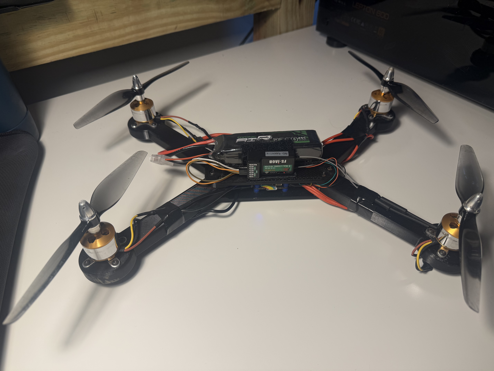
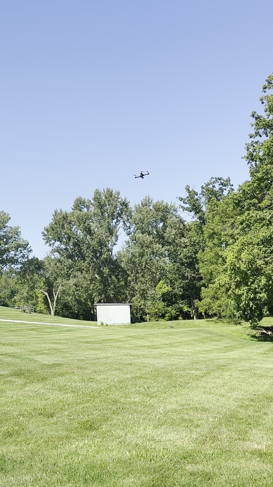
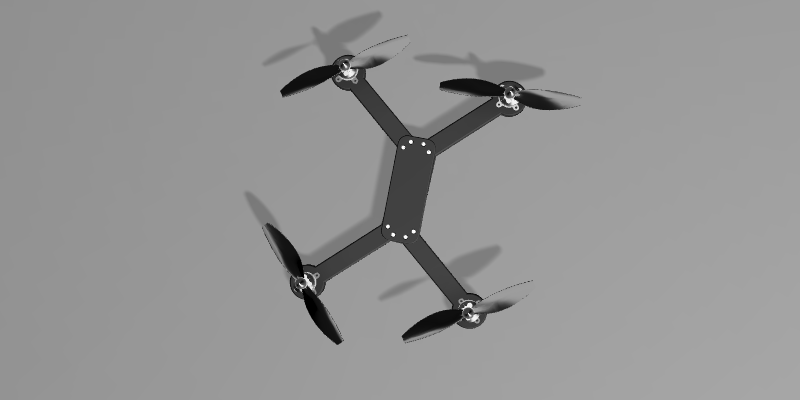
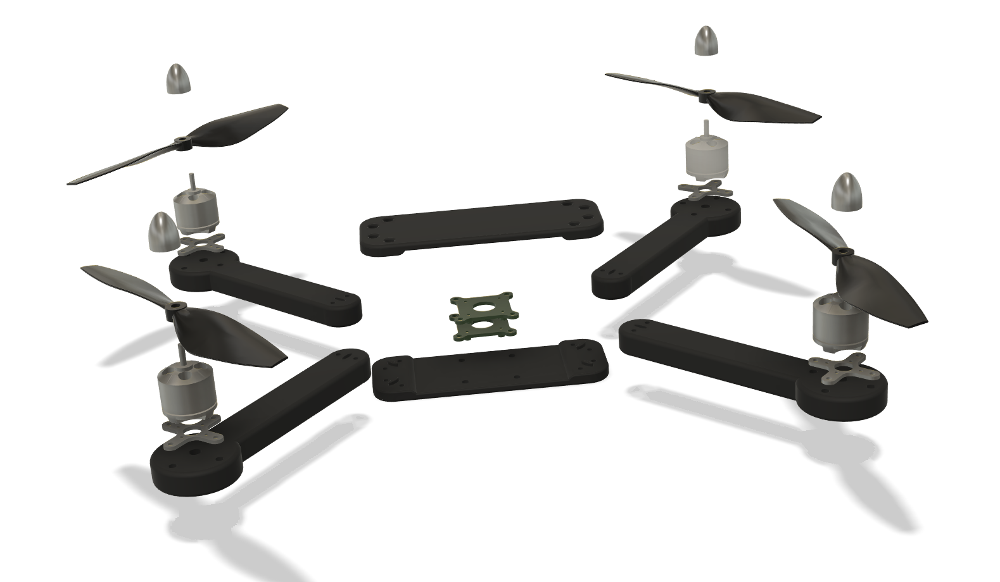

# Custom 7-Inch Quadcopter

> A custom drone I designed, built, and got flying—learning CAD, 3D printing, electronics, and flight control along the way.


<p align="center">
  
</p>


<p align="center">
  <b>Mechanical Design</b> · <b>Additive Manufacturing</b> · <b>Electronics Integration</b> · <b>Flight Controls</b> · <b>Testing & Troubleshooting</b>
</p>

## Flight Demonstration

The custom quadcopter successfully achieved takeoff, stable hover, and controlled flight after iterative mechanical and software refinement.

<p align="center">
  <a href="https://youtube.com/shorts/He_OBPB06JE" target="_blank">
    
  </a>
</p>

**[Watch the flight test →](https://youtube.com/shorts/He_OBPB06JE)** This demonstrates stable hover and controlled flight. Full test details in [Testing and Validation](docs/TESTING.md).


## Project Overview

I wanted to learn everything end-to-end. So instead of buying a kit, I designed the frame in Fusion 360, printed it in PETG, integrated all the electronics and motors, and got it flying. It's been a really fun way to learn about how all these systems actually work—from CAD design to 3D printing to flight control.

### Final Result

- **Flight status:** Successful takeoff, hover, and controlled flight
- **Final mass:** Approximately **756 g**
- **Configuration:** Custom X-configuration quadcopter
- **Propellers:** 7-inch, two-blade
- **Battery:** 3S 2200 mAh LiPo
- **Flight software:** Betaflight 4.5.3
- **Airframe material:** PETG
- **CAD platform:** Autodesk Fusion 360


## Why I Built It

Honestly, I just wanted to build a drone and understand how everything works. I wanted to learn how all the parts—motors, controllers, propellers, radio—actually work together as a system. And yeah, I wanted to actually fly something I built myself. Beyond that, I also wanted to create a custom frame that I could iterate on and improve over time. Every drone project teaches me something new, and I can take those lessons and build better versions. That's what excites me about engineering—the continuous improvement cycle and the hands-on learning that comes with it.


## Engineering Development Process

```text
Requirements
      ↓
Component Selection
      ↓
CAD Design (Fusion 360)
      ↓
3D Printing (PETG)
      ↓
Mechanical Assembly
      ↓
Electronics Integration
      ↓
Betaflight Configuration
      ↓
Subsystem Testing
      ↓
Flight Testing
      ↓
Successful Hover
```


## Engineering Highlights

### Mechanical Design

- Designed a modular frame with replaceable arms and separate top and bottom plates.
- Sized the center structure around the flight-controller and ESC stack.
- Incorporated motor mounting, wire routing, fastener access, and structural thickness constraints.
- Used PETG to balance impact resistance, printability, mass, and cost.
- Iterated arm and plate geometry to improve fit, stiffness, and assembly.

### Electronics Integration

- Integrated a 4-in-1 ESC and F405 flight controller.
- Connected A2212 1000KV brushless motors.
- Wired and configured a FlySky receiver using iBUS.
- Used an OVONIC 3S 2200 mAh LiPo battery.
- Resoldered and insulated connections after identifying reliability concerns.
- Verified motor order and direction before installing propellers.

### Flight Controls & Configuration

- Configured Betaflight 4.5.3.
- Calibrated the accelerometer on a level surface.
- Corrected flight-controller orientation and verified the 3D model response.
- Configured receiver endpoints, channel mapping, and an arm switch.
- Verified commanded motor direction against the Betaflight motor diagram.
- Diagnosed apparent throttle increases as flight-controller stabilization response during restrained or unstable testing.

### Testing & Troubleshooting

The project included several failures before successful flight. These failures became the most valuable engineering portion of the build.

| Issue | Investigation | Resolution / Lesson |
|---|---|---|
| Vehicle flipped during takeoff | Checked motor order, motor direction, propeller orientation, board alignment, and accelerometer calibration | Corrected configuration and verified every propulsion channel individually |
| Betaflight model moved incorrectly | Compared physical roll, pitch, and yaw motion with the setup model | Adjusted board orientation and recalibrated |
| Receiver setup problems | Checked wiring, protocol, channel mapping, and endpoints | Used iBUS wiring and configured usable channel ranges |
| Motor speed appeared to increase without throttle input | Evaluated behavior with props removed and during attitude disturbances | Recognized stabilization behavior and avoided unsafe restrained testing with props |
| Suspected unreliable electrical joints | Inspected, resoldered, and insulated connections | Improved electrical reliability and assembly quality |
| Initial flight instability and drift | Rechecked calibration and practiced small control inputs | Achieved flight; future work includes tuning and pilot practice |

## System Specifications

| Subsystem | Component / Value |
|---|---|
| Flight controller | F405-based controller |
| Firmware | Betaflight 4.5.3 |
| ESC | 45 A 4-in-1 ESC |
| Motors | A2212 1000KV brushless outrunners |
| Propellers | 7-inch two-blade |
| Battery | OVONIC 3S, 2200 mAh, 25C |
| Radio transmitter | FlySky FS-i6 |
| Receiver | FlySky receiver using iBUS |
| Frame | Custom Fusion 360 design |
| Frame material | PETG |
| Final vehicle mass | ~756 g |

## Repository Navigation

```text
custom-7-inch-quadcopter/
├── README.md                  # Project overview and recruiter-facing summary
├── docs/
│   ├── DESIGN.md              # Requirements, CAD decisions, and manufacturing
│   ├── ELECTRONICS.md         # Wiring and component integration
│   ├── TESTING.md             # Test plan, failures, and flight validation
│   └── LESSONS_LEARNED.md     # Engineering reflection
├── media/
│   ├── images/                # Build, CAD, wiring, and flight photos
│   └── videos/                # Hover and flight clips
├── cad/                       # CAD renders, drawings, and exported STEP/STL files
├── config/                    # Betaflight backup and settings notes
├── test-data/                 # Mass, motor, battery, or flight-test records
├── BOM.csv                    # Bill of materials
└── .gitignore
```

## Design Process

<p align="center">
  
</p>

The airframe was developed around the physical size of the electronics stack, motors, propellers, wiring, and fasteners. The frame uses a central plate assembly and four removable arms. This architecture makes damaged arms replaceable without requiring the entire frame to be reprinted.

More detail: **[Mechanical Design](docs/DESIGN.md)**


## CAD Assembly

The quadcopter was designed as a modular assembly consisting of replaceable motor arms, a two-piece center plate, and commercially available propulsion and control components.

<p align="center">
  
</p>

The exploded assembly illustrates how the custom manufactured components integrate with the electronics and propulsion system.


## Engineering Documentation

<p align="center">

</p>

Professional engineering drawings were created directly from the Fusion 360 assembly including dimensions, exploded views, bill of materials, and assembly references.


## Assembly & Wiring

Assembly required careful management of motor-wire routing, solder-joint quality, receiver connections, component orientation, and access to the flight-controller USB port.

**Assembly details:**
- [electronics-wiring-detail.jpg](media/images/electronics-wiring-detail.jpg) — Flight controller, ESC, receiver, and battery integration
- [flight-controller-mount.jpg](media/images/flight-controller-mount.jpg) — Receiver and FC mounting
- [arm-motor-detail.jpg](media/images/arm-motor-detail.jpg) — Motor, propeller, and power connector

More detail: **[Electronics Integration](docs/ELECTRONICS.md)**

## Validation

The vehicle was tested incrementally rather than proceeding directly to full flight:

- CAD fit and assembly checks
- Continuity and solder-joint inspection
- Smoke-stopper power-up
- Receiver input verification
- Individual motor tests with propellers removed
- Motor order and direction verification
- Accelerometer and orientation verification
- Low-altitude takeoff tests
- Hover and controlled-flight demonstration

More detail: **[Testing and Validation](docs/TESTING.md)**


## Lessons Learned

This project emphasized the importance of validating each subsystem independently before full system integration.

Some of the most valuable lessons included:

- Mechanical design must consider manufacturing and assembly simultaneously.
- Flight controller orientation is critical for stable flight.
- Propeller orientation and motor direction should always be verified independently.
- Careful soldering and wire management improve long-term reliability.
- Incremental testing dramatically reduces troubleshooting time.
- Engineering documentation is just as important as the finished hardware.


## Skills Demonstrated

- Fusion 360 CAD and mechanical design
- Design for additive manufacturing
- PETG 3D printing
- Brushless motor and ESC integration
- Soldering and wiring
- Flight-controller configuration
- Radio and receiver setup
- System-level troubleshooting
- Test planning and risk reduction
- Engineering documentation
- Iterative design and root-cause analysis

## Current Limitations

- The vehicle still requires tuning for smoother low-altitude flight.
- Pilot control proficiency is developing.
- Flight time, vibration, and thrust data have not yet been formally measured.
- Structural performance has not yet been validated with FEA or physical load testing.
- Aerodynamic performance has not yet been evaluated using CFD.

Being explicit about limitations is important: this repository documents a functional prototype, not a production-qualified aircraft.

## Future Work

- Record stabilized hover and forward-flight videos.
- Measure flight time and battery voltage under load.
- Log vibration and gyro data.
- Tune PID and rate settings for low-altitude stability.
- Perform static thrust testing.
- Conduct structural FEA on the arms and center plates.
- Run a basic CFD study around the frame and propeller slipstream.
- Reduce airframe mass while maintaining stiffness.
- Add GPS and autonomous-flight capability using INAV or ArduPilot.

## Safety

Propellers were removed during configuration and motor-direction testing. Initial power-up used a smoke stopper, and flight testing was performed at low altitude in an open area.

## Author

**Wilson Henry Choate**  
Aerospace Engineering Student, Penn State University

- Email: [wilson.choate.pro@gmail.com](mailto:wilson.choate.pro@gmail.com)
- LinkedIn: [linkedin.com/in/wilson-choate-252b5232a](https://www.linkedin.com/in/wilson-choate-252b5232a/)
- GitHub: [github.com/wilsonhchoate-oss](https://github.com/wilsonhchoate-oss)
