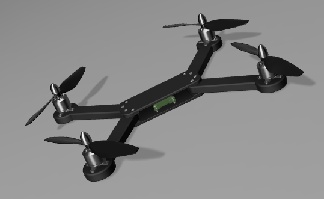
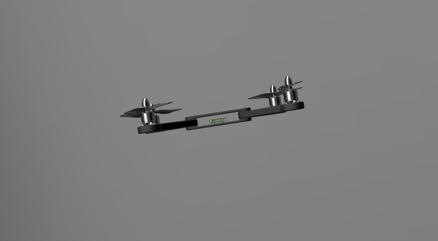
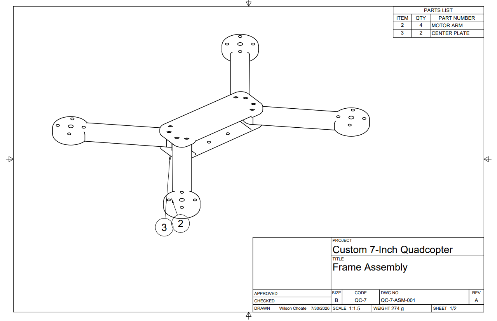

# Custom 7-Inch Quadcopter

> A ground-up quadcopter designed, manufactured, assembled, configured, tested, and flown as an independent aerospace engineering project.

<p align="center">
  
</p>

<p align="center">
  <b>Mechanical Design</b> · <b>Additive Manufacturing</b> · <b>Electronics Integration</b> · <b>Flight Controls</b> · <b>Testing & Troubleshooting</b>
</p>

## Flight Demonstration

The custom quadcopter achieved a sustained, stable, high-altitude flight (~200 ft) in an open field — real validation that the airframe, electronics, and tuning all work together as an integrated system, not just in short hops.

<p align="center">
  
</p>

<p align="center">
  <a href="media/videos/flight-test-highlight.mp4">🎥 Watch the flight-test highlight clip</a>
</p>

That same flight ended the test session: a propeller detached in flight at altitude, and the vehicle free-fell and broke an arm on impact. The frame's fastener/joint design (see [Mechanical Design](docs/DESIGN.md)) is rated for minor low-altitude impacts, not a ~200 ft free-fall — this wasn't a repeat of the earlier structural problems, it's a distinct propeller-retention issue. The fix is a straightforward arm reprint, and I'm evaluating wall count and infill changes for added strength while I'm at it. See [Testing and Validation](docs/TESTING.md) for the full writeup.

## Origin Story

I didn't set out knowing how drones worked — I wanted to find out, and to prove to myself I could design and build something that actually flies. This project went through two full builds:

1. **An Arduino-based prototype** (scrapped fall 2025) — a self-taught first attempt using an Arduino Uno, an MPU-6050 gyroscope, and a practice PID loop. It never got off the ground, but it's the reason this build exists. Full story: **[The Arduino Prototype](docs/ARDUINO_PROTOTYPE.md)**
2. **This build** — a dedicated F405 flight controller and Betaflight, a frame designed from scratch through multiple iterations, and a design philosophy built around surviving crashes rather than avoiding them.

## Project Overview

I designed and built a custom quadcopter from scratch to develop hands-on experience across the full mechatronic stack: airframe design, CAD, additive manufacturing, propulsion integration, wiring and soldering, flight-controller configuration, and iterative flight testing.

Unlike a kit build, the airframe was modeled in Fusion 360 and manufactured in-house on an FDM printer using PETG. The project required integrating the frame, motors, electronic speed controller, flight controller, receiver, battery, and propellers into a working aircraft, then diagnosing and correcting multiple real failures — a flipped takeoff, misbehaving stabilization, and unreliable solder joints — before reaching controlled flight.

### Final Result

- **Flight status:** Achieved sustained, stable flight to ~200 ft altitude in an open field; a propeller detached at the end of that flight, breaking an arm on impact (repair: reprint in progress)
- **Final mass:** Approximately **756 g**
- **Configuration:** Custom X-configuration quadcopter
- **Propellers:** 7-inch, two-blade
- **Battery:** 3S 2200 mAh LiPo
- **Flight software:** Betaflight 4.5.3
- **Airframe material:** PETG (FDM 3D-printed)
- **CAD platform:** Autodesk Fusion 360

## Why I Built It

The goal wasn't just to get a drone in the air — it was to run a complete engineering development cycle, start to finish, on my own:

1. Define requirements and constraints.
2. Select compatible propulsion and control hardware.
3. Design a manufacturable airframe.
4. Fabricate and assemble the system.
5. Configure the flight controller and radio.
6. Test subsystems safely, in isolation, before combining them.
7. Diagnose failures and revise the design.
8. Demonstrate stable flight.

## Engineering Development Process

```text
Requirements
      ↓
Component Selection
      ↓
CAD Design (Fusion 360)
      ↓
3D Printing (PETG)
      ↓
Mechanical Assembly
      ↓
Electronics Integration
      ↓
Betaflight Configuration
      ↓
Subsystem Testing
      ↓
Flight Testing
      ↓
Successful Hover
```

## Engineering Highlights

### Mechanical Design

- Designed a modular frame in Fusion 360 with replaceable arms and separate top/bottom center plates, so a crash only costs one printed part instead of the whole airframe.
- Sized the center structure around the flight-controller and ESC stack footprint, wiring channels, and fastener access.
- Selected PETG for the balance of impact resistance, print reliability, mass, and cost over standard PLA.
- Iterated arm and plate geometry across multiple revisions to improve fit, stiffness, and ease of assembly.
- Produced full engineering drawings from the Fusion 360 assembly, including dimensions, exploded views, and a bill of materials.

### Electronics Integration

- Integrated a 4-in-1 ESC with an F405 flight controller and four A2212 1000KV brushless motors.
- Wired and configured a FlySky receiver over the iBUS protocol.
- Selected and integrated an OVONIC 3S 2200 mAh LiPo battery.
- Identified an electrical reliability issue in early testing, then resoldered and insulated connections to fix it.
- Verified motor order and rotation direction against the flight-controller motor map before ever installing propellers.

### Flight Controls & Configuration

- Configured and tuned Betaflight 4.5.3 from a blank setup.
- Calibrated the accelerometer and corrected flight-controller board orientation after the 3D model in Betaflight didn't match the vehicle's real-world motion.
- Configured receiver endpoints, channel mapping, and an arm switch for safe ground handling.
- Diagnosed an apparent uncommanded throttle increase as normal stabilization response under restrained testing — and changed the test procedure rather than the hardware, avoiding an unsafe workaround.

### Testing & Troubleshooting

The project included several real failures before successful flight — this is the part of the build that generated the most engineering learning.

| Issue | Investigation | Resolution / Lesson |
|---|---|---|
| Vehicle flipped during takeoff | Checked motor order, motor direction, propeller orientation, board alignment, and accelerometer calibration | Corrected configuration and verified every propulsion channel individually |
| Betaflight 3D model moved incorrectly | Compared physical roll, pitch, and yaw motion against the on-screen model | Adjusted board orientation and recalibrated |
| Receiver setup problems | Checked wiring, protocol, channel mapping, and endpoints | Switched to iBUS wiring and configured usable channel ranges |
| Motor speed appeared to increase without throttle input | Evaluated behavior with props removed and during attitude disturbances | Identified normal stabilization behavior and avoided unsafe restrained testing with props on |
| Suspected unreliable electrical joints | Inspected, resoldered, and insulated connections | Improved electrical reliability and assembly quality |
| Flight instability and drift during hover | Rechecked calibration and practiced small control inputs | Achieved stable, sustained high-altitude flight in an open field — drift was not an issue during this test |
| Propeller detached in flight at ~200 ft, vehicle free-fell and broke an arm on impact | Inspected the frame post-crash; damage was isolated to one arm/motor mount | Not a repeat of earlier structural issues — a distinct propeller-retention problem. Fix: reprint the arm (evaluating wall count/infill for added strength); add a pre-flight prop-security check to the routine |

## System Specifications

| Subsystem | Component / Value |
|---|---|
| Flight controller | F405-based controller |
| Firmware | Betaflight 4.5.3 |
| ESC | 45 A 4-in-1 ESC |
| Motors | A2212 1000KV brushless outrunners |
| Propellers | 7-inch two-blade |
| Battery | OVONIC 3S, 2200 mAh, 25C |
| Radio transmitter | FlySky FS-i6 |
| Receiver | FlySky receiver using iBUS |
| Frame | Custom Fusion 360 design |
| Frame material | PETG |
| Final vehicle mass | ~756 g |

## Repository Navigation

```text
custom-7-inch-quadcopter/
├── README.md                  # Project overview and recruiter-facing summary
├── docs/
│   ├── ARDUINO_PROTOTYPE.md     # Origin story: the scrapped Arduino/MPU-6050 build
│   ├── DESIGN.md                # Requirements, CAD decisions, and manufacturing
│   ├── ELECTRONICS.md           # Wiring and component integration
│   ├── TESTING.md               # Test plan, failures, and flight validation
│   └── LESSONS_LEARNED.md       # Engineering reflection
├── media/
│   ├── images/                  # Build, CAD, wiring, and flight photos
│   ├── sketches/                # Design-notebook pages: calcs, geometry, trade studies
│   └── videos/                  # Hover, flight, and CAD animation clips
├── cad/                         # Fusion 360 exports: assemblies, drawings, components
├── config/                      # Betaflight backup and settings notes
├── test-data/                   # Mass, motor, battery, and flight-test records
├── BOM.csv                      # Bill of materials
└── .gitignore
```

## Design Process

<p align="center">
  
</p>

The airframe was developed around the physical size of the electronics stack, motors, propellers, wiring, and fasteners. The frame uses a central plate assembly and four removable arms, so a damaged arm can be reprinted and swapped in without rebuilding the whole airframe.

More detail: **[Mechanical Design](docs/DESIGN.md)**

## CAD Assembly

<p align="center">
  
</p>

The quadcopter is a modular assembly of replaceable motor arms, a two-piece center plate, and commercially available propulsion and control components. The exploded view above shows how the custom-manufactured parts integrate with the electronics and propulsion system.

<p align="center">
  <a href="media/videos/Exploded%20Assembly%20Video.mp4">🎥 Watch the exploded-assembly animation (Fusion 360)</a>
</p>

## Engineering Documentation

<p align="center">
  
</p>

Full engineering drawings were generated directly from the Fusion 360 assembly, including dimensions, an exploded view, and a bill-of-materials callout table.

## Assembly & Wiring

<p align="center">
  
</p>

Assembly required careful management of motor-wire routing, solder-joint quality, receiver connections, component orientation, and clear access to the flight-controller USB port.

More detail: **[Electronics Integration](docs/ELECTRONICS.md)**

## Validation

The vehicle was tested incrementally rather than jumping straight to full flight:

- CAD fit and assembly checks
- Continuity and solder-joint inspection
- Smoke-stopper power-up
- Receiver input verification
- Individual motor tests with propellers removed
- Motor order and direction verification
- Accelerometer and orientation verification
- Low-altitude takeoff tests
- Sustained high-altitude flight test (~200 ft) in an open field
- Post-crash inspection and failure analysis after an in-flight propeller detachment

More detail: **[Testing and Validation](docs/TESTING.md)**

## Lessons Learned

This project reinforced the value of validating each subsystem independently before full system integration — most of the hard problems showed up at the interfaces, not inside any one part.

Some of the most valuable lessons:

- Mechanical design has to account for manufacturing and assembly at the same time, not as an afterthought.
- Flight-controller orientation is critical for stable flight, and it's worth double-checking before the first power-up, not after a bad one.
- Propeller orientation and motor direction should always be verified independently, per motor.
- Careful soldering and wire management pay off in reliability, not just at final assembly but every time you open the frame back up.
- Incremental, isolated testing dramatically cuts down troubleshooting time.
- Documentation is part of the deliverable, not an afterthought — this README is as much a part of the project as the frame is.
- A structural design is only rated for the impacts it was designed for — a frame built to survive minor low-altitude tip-overs isn't expected to survive a ~200 ft free-fall undamaged, and that's a different conversation than whether the design "failed."
- Propeller retention deserves the same rigor as everything else that gets checked pre-flight — it was the one thing not on the routine checklist, and it's the thing that ended the flight.

## Skills Demonstrated

- Fusion 360 CAD and mechanical design
- Design for manufacturing (DFM) and additive manufacturing
- FDM 3D printing (PETG)
- Brushless motor and ESC integration
- Soldering, wiring, and electrical troubleshooting
- Flight-controller configuration and PID/rate tuning (Betaflight)
- Radio and receiver setup (FlySky, iBUS)
- Root-cause analysis and systematic debugging
- Test planning and risk reduction
- Technical/engineering documentation
- Iterative design and prototyping

## Current Limitations

- One arm needs to be reprinted after the propeller-detachment crash; the vehicle is grounded until that repair is complete.
- Propeller retention doesn't yet have a formal pre-flight check — that's the direct fix coming out of this test.
- Flight time, vibration, and thrust data haven't been formally measured yet.
- Structural performance hasn't been validated with FEA or physical load testing.
- Aerodynamic performance hasn't been evaluated with CFD.

Being explicit about limitations matters: this repository documents a functional prototype, not a production-qualified aircraft.

## Future Work

- Add a propeller-security check (torque/thread-locker verification) to the pre-flight routine.
- Re-evaluate arm wall count and infill for additional impact strength.
- Measure flight time and battery voltage under load.
- Log vibration and gyro data.
- Perform static thrust testing.
- Run structural FEA on the arms and center plates.
- Run a basic CFD study around the frame and propeller slipstream.
- Reduce airframe mass while maintaining stiffness.
- Add GPS and autonomous-flight capability using iNav or ArduPilot.

## Safety

Propellers were removed during configuration and motor-direction testing, and initial power-up used a smoke stopper. Flight testing progressed from low-altitude hovers to a sustained high-altitude flight (~200 ft) in a large, open area, clear of people and structures.

## Author

**Wilson Henry Choate**
Aerospace Engineering Student, Penn State University

- LinkedIn: `ADD_LINKEDIN_URL`
- GitHub: `ADD_GITHUB_PROFILE_URL`
- Email: `ADD_PROFESSIONAL_EMAIL`
