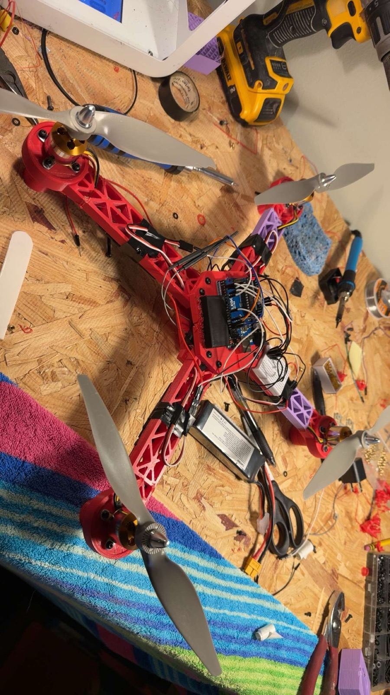

# Origin Story: The Arduino Prototype

Before this project existed, I didn't know how drones worked. I wanted to find out — and to prove to myself that I could design and build something that actually flies, not just follow a kit.

## Starting Point

It started with an Arduino starter kit I bought for myself to learn the basics of microcontrollers, sensors, and wiring. That curiosity turned into a question: could I take what I was learning and build an actual quadcopter with it?

  

## Building It

I sketched the frame myself and printed the parts on a Toybox 3D printer — a small home printer my dad got the family a couple of years earlier. Along the way I taught myself to solder well enough to wire up the build.

The electronics were:

- **Arduino Uno** as the flight computer
- **MPU-6050** as the gyroscope/accelerometer for attitude sensing
- A breadboard for prototyping the wiring before anything was permanent
- Brushless motors and ESCs salvaged/sourced for the build

The control loop itself was AI-written rather than something I derived myself — I treated the whole thing as a practice run to learn the mechanics of ESC signaling, sensor reads, and motor control, not as a serious attempt at a tuned flight controller.

## Why It Never Flew

The frame was a poor structural design. It wasn't going to hold up if I actually built up enough throttle to fly it hard, and a real crash would have broken it badly. Between the frame's fragility and a PID loop that was never more than a rough practice implementation, the vehicle was tested but never achieved hover.

I scrapped the Arduino approach in fall 2025.

## What Carried Forward

This prototype wasn't wasted effort — it directly shaped the project that replaced it:

- It proved I needed a **dedicated flight controller and ESC stack** (Betaflight on an F405 board) instead of a hand-rolled Arduino control loop, which led directly to the [main build](../README.md).
- It made **crash survivability** a first-class design requirement for the next frame — see the fastener and joint design in [Mechanical Design](DESIGN.md).
- It gave me the soldering, wiring, and sensor-integration experience that made the electronics side of the second build go faster.

The current build picked back up in spring 2026, once I had the F405 flight controller and ESC stack in hand and a new frame design in progress.
