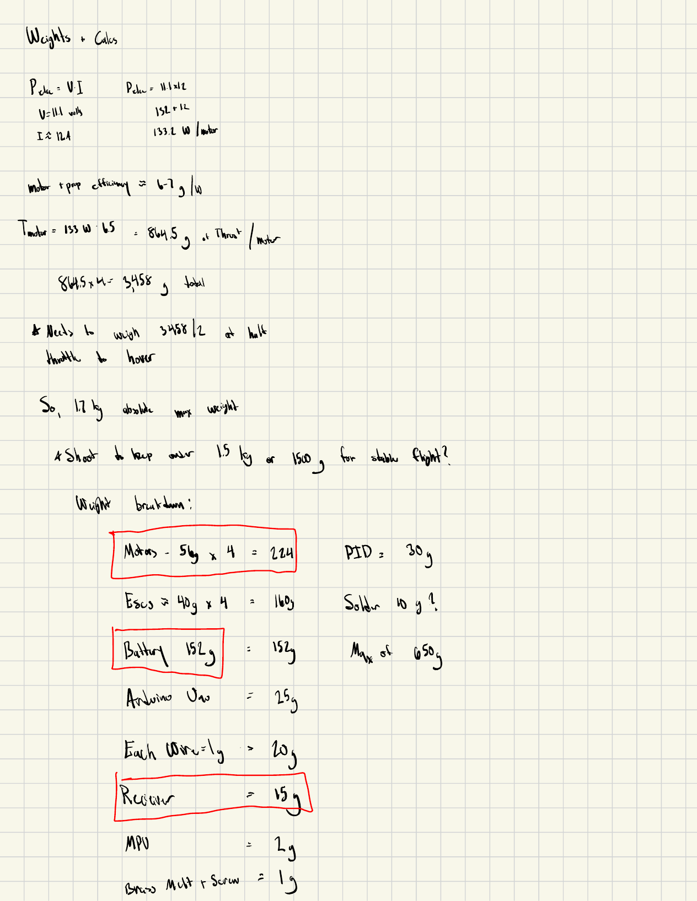
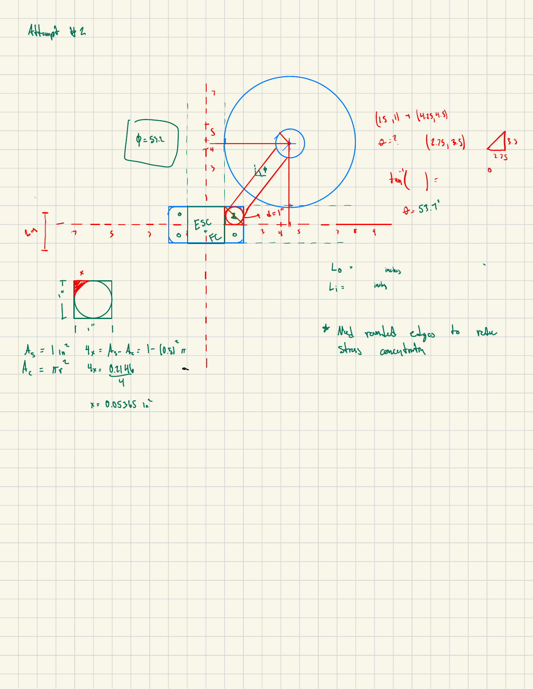
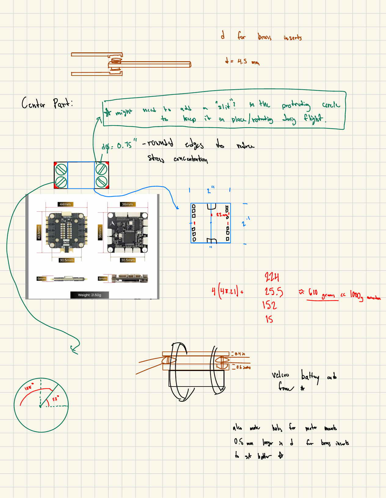
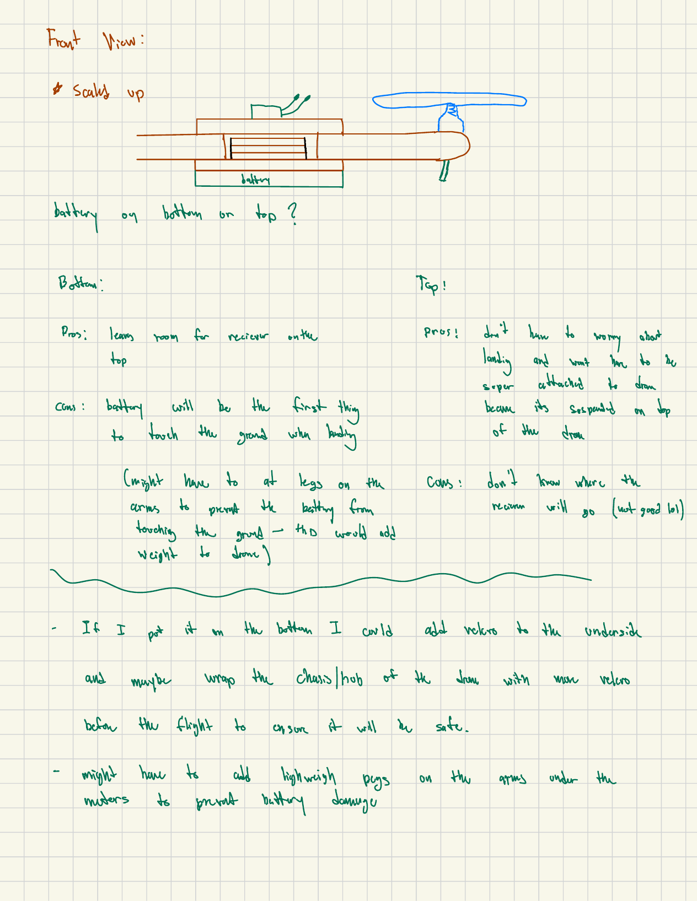
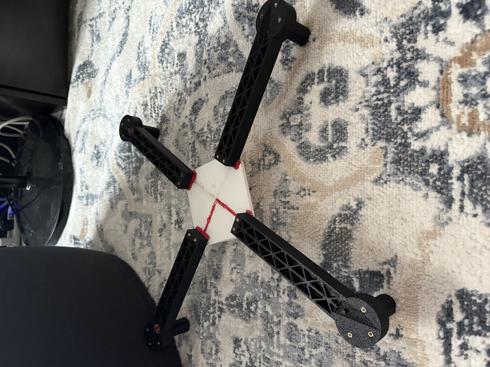

# Mechanical Design

## Requirements

The frame needed to:

- Support four A2212 motors and 7-inch propellers.
- Package the flight controller, 4-in-1 ESC, receiver, and battery.
- Be printable on a consumer FDM printer.
- Survive minor low-altitude impacts.
- Allow damaged arms to be replaced.
- Provide access for wiring, fasteners, and the flight-controller USB port.
- Keep total vehicle mass low enough for stable flight.

## Architecture

The selected architecture uses four removable arms captured between top and bottom center plates. This modular approach reduces repair cost and print time after an impact.

## Material Selection

PETG was selected because it provides greater toughness and heat resistance than standard PLA while remaining easy to print on a consumer machine.

## Weight & Thrust Budget

Before committing to a frame size, I worked backward from a thrust-to-weight target instead of just guessing at dimensions.

  

Using the motor's power draw and an assumed motor+prop efficiency (roughly 6–7 g of thrust per watt), I estimated per-motor thrust and used it to set a target hover throttle near 50% — meaning total thrust needed to be roughly double the vehicle's all-up weight for stable, controllable flight. That put a practical ceiling on total mass (target well under 1.5 kg) before a single part was modeled. The frame, electronics, and battery selections below were all checked against this budget. The vehicle came in at approximately 756 g, comfortably under the ceiling.

## Frame Geometry & Prop Clearance

Arm length isn't a free choice — it's constrained by propeller diameter (props can't overlap) and by the printer's build volume. I worked this out with basic right-triangle geometry: propellers needed roughly 13 inches of separation center-to-center, which combined with the printer's ~220 mm (≈8.7 in) build volume set the maximum usable arm length.

  

Later revisions refined this further, solving for the angle between the arm and the ESC/flight-controller footprint so the stack would actually fit inside the arm splay without interfering with prop clearance.

## Fastener & Joint Design

Crash survivability was a hard requirement, not a nice-to-have — it came directly out of watching the [Arduino prototype's](ARDUINO_PROTOTYPE.md) frame nearly fail under normal handling. The center plate and arms needed a joint that could take repeated impacts without loosening or cracking.

  

The design that survived testing:

- **Two M3 screws** pass through the top plate, the arm, and the bottom plate, with a **nut twisted on underneath** to clamp the joint rather than threading directly into printed plastic.
- **Brass heat-set threaded inserts** (~4.5 mm OD) are used at each screw location so the plastic threads don't strip after repeated assembly/disassembly.
- **Two small alignment pegs** on the center plate seat into matching pockets in the arm, resisting side-to-side (left-right) shear that the screws alone don't fully constrain.
- Edges around the protruding boss on the center plate were rounded rather than left square, specifically to reduce stress concentration at that feature.

This combination is why the frame has survived several crashes with no structural damage so far. I can't say for certain how much the alignment pegs specifically reduce vibration — subjectively the vehicle doesn't vibrate much in flight, but that hasn't been measured.

## Battery Mounting

Where to put the battery wasn't obvious, so I worked through it as an explicit trade study before committing:

  

| Location | Pros | Cons |
|---|---|---|
| Bottom | Leaves room for the receiver on top | Battery is the first thing to touch the ground on landing (mitigated with standoff legs/pegs, at a small mass cost) |
| Top | No landing-clearance concern | Less obvious placement for the receiver; added the risk of the battery detaching if it's not properly secured |

Bottom-mounting won out. The plan to protect it: a velcro strap around the battery and chassis rather than relying on tension alone, plus lightweight pegs under the motor arms so the battery never directly contacts the ground on landing.

## Design Evolution

The current frame is the result of several distinct attempts, not a single design pass:

  

1. **Early concept (scrapped):** arms joined to a plate using a lashed/tied connection rather than a mechanical fastener. It was oversized and I didn't like the fit or the bulk, so I dropped it before it went further.
2. **"Attempt #2" geometry:** reworked the arm angle and center-plate footprint against the ESC/flight-controller stack size, using the trig above to make sure everything actually fit together.
3. **Actual frame design:** converged on the current geometry, then layered in the fastener and joint design (above) once the base geometry was solid.

Each revision was driven by a concrete problem with the one before it — either the geometry didn't leave room for the electronics, or the joint wasn't going to survive a real crash.

## Manufacturing

Record the final settings used:

| Parameter | Final Value |
|---|---|
| Printer | Bambu Lab A1 |
| Material | PETG |
| Nozzle diameter | 0.40 mm |
| Layer height | 0.20 mm |
| Wall loops | ADD |
| Top layers | ADD |
| Bottom layers | ADD |
| Infill percentage | 35% |
| Infill pattern | Gyroid |
| Nozzle temperature | ADD |
| Bed temperature | ADD |
| Total frame print mass | ADD |

*(Nozzle diameter, layer height, and infill pulled from the `Overall_frame_dimensions` drawing notes — remaining fields need to be pulled from your slicer profile.)*
