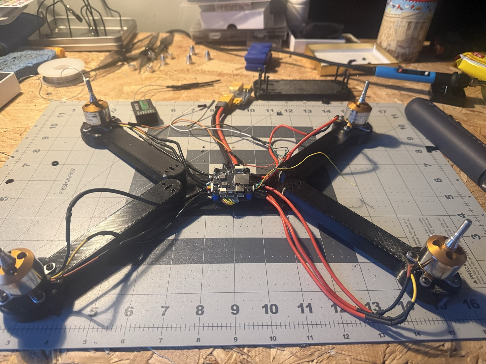
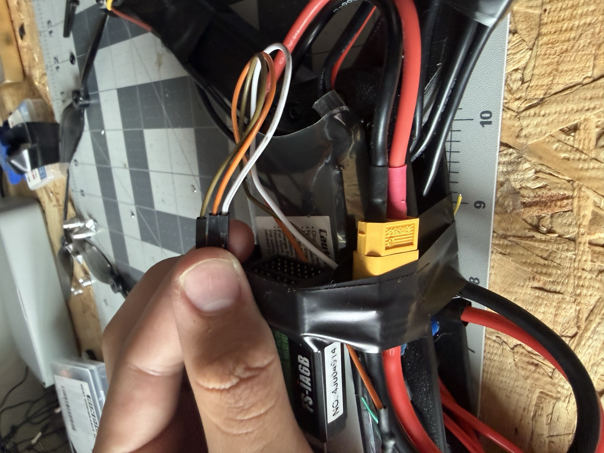
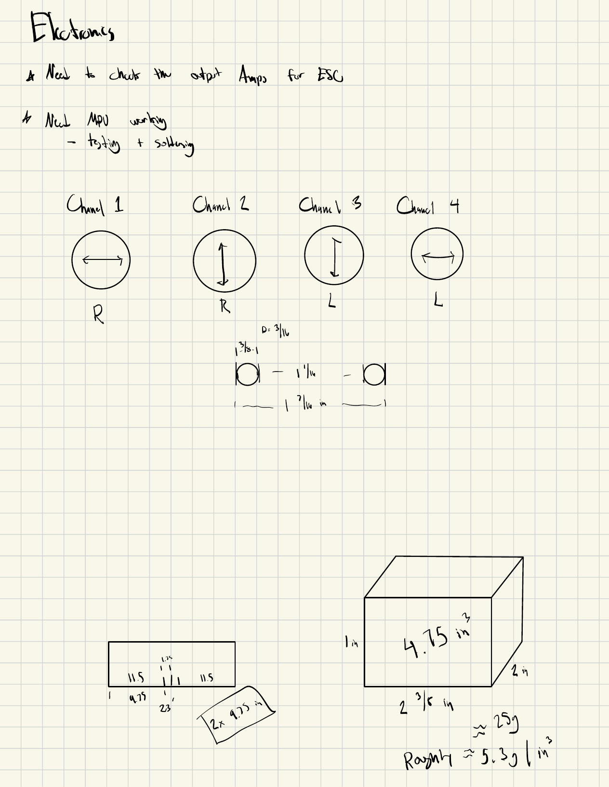

# Electronics Integration

## System Architecture

```text
3S LiPo
   |
   v
4-in-1 ESC ------> Four brushless motors
   |
   v
Flight Controller
   |
   +------> FlySky receiver via iBUS
   |
   +------> USB connection for Betaflight
```

## Wiring Documentation

<p align="center">
  
</p>

<p align="center">
  
</p>

The receiver connection is a single iBUS signal wire plus power/ground from the flight controller, rather than one wire per channel. Motor outputs, ESC power leads, and the receiver connection were kept physically separated where possible to make later troubleshooting easier.

Note on the onboard sensor: this build's attitude sensing comes from the F405 flight controller's own IMU. The earlier [Arduino prototype](ARDUINO_PROTOTYPE.md) used a standalone MPU-6050 breakout wired to an Arduino Uno — that sensor and control loop were retired along with the rest of that build.

## Configuration Summary

<p align="center">
  
</p>

| Setting | Value |
|---|---|
| Firmware | Betaflight 4.5.3 |
| Receiver protocol | iBUS |
| Arm control | AUX switch |
| Transmitter | FlySky FS-i6, Mode 2 |
| Channel map | CH1 = Roll (right stick, left/right), CH2 = Pitch (right stick, up/down), CH3 = Throttle (left stick, up/down), CH4 = Yaw (left stick, left/right) |
| Motor protocol | ADD |
| Board alignment | ADD FINAL VALUES |
| Failsafe behavior | ADD |

## Quality Checks

- Inspected solder joints.
- Verified polarity before power-up.
- Used a smoke stopper during initial power testing.
- Tested receiver channels in Betaflight.
- Tested each motor individually without propellers.
- Confirmed motor direction and motor numbering.
- Secured and insulated wiring before flight.

## Betaflight Backup

Export the final configuration using the Betaflight CLI:

```text
diff all
```

Save the output as:

```text
config/betaflight-diff-all.txt
```

Do not publish Wi-Fi passwords, personal information, serial numbers you consider private, or unrelated device data.
