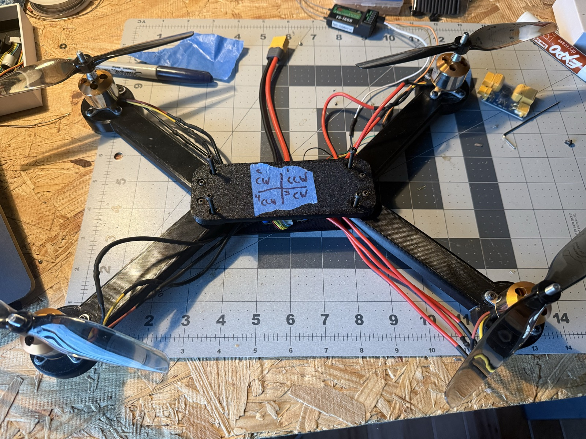
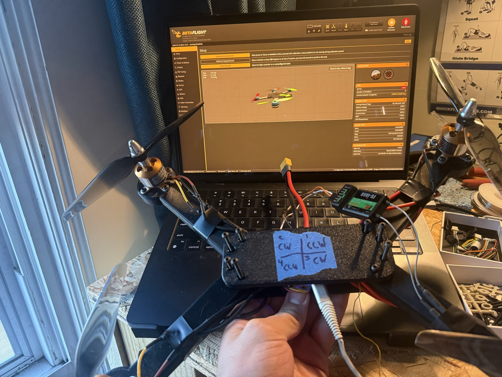
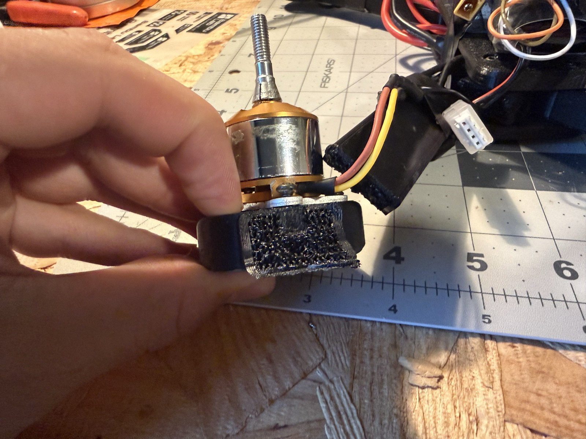

# Testing and Validation

## Test Philosophy

Testing progressed from low-risk subsystem checks to integrated flight tests. Propellers were not installed until receiver input, flight-controller orientation, motor order, and motor direction had been verified.

## Test Matrix

| Test | Configuration | Pass Criteria | Result |
|---|---|---|---|
| Visual inspection | Unpowered | No exposed conductors or loose hardware | PASS |
| Continuity / polarity | Unpowered | No short across battery input | ADD |
| Smoke-stopper power-up | Props removed | Normal startup, no overheating | PASS |
| Receiver test | Props removed | Correct channel response and endpoints | PASS |
| Accelerometer test | Props removed | Betaflight model matches physical motion | PASS |
| Individual motor test | Props removed | Correct motor responds | PASS |
| Direction test | Props removed | Each motor matches diagram | PASS |
| One-minute motor run | Props removed | No abnormal heating or vibration | PASS |
| Low-throttle test | Props installed | Symmetric spool-up | PASS |
| Takeoff test | Open area | Clean liftoff without tip-over | PASS AFTER ITERATION |
| Hover test | Low altitude | Sustained controlled hover | PASS |
| Controlled flight | Open area | Pilot can translate and land safely | PASS — sustained, stable flight to ~200 ft altitude in an open field |
| High-altitude flight endurance | Open field | Sustained flight without loss of control | PASS, THEN IN-FLIGHT FAILURE — stable up to ~200 ft; propeller detached at the end of the flight, vehicle free-fell and broke an arm on impact |

## Failure Analysis

### Takeoff Flip

**Observed behavior:** The aircraft became light on its landing surface and flipped.

**Possible causes evaluated:**

- Incorrect motor order
- Incorrect motor rotation
- Incorrect propeller placement
- Incorrect flight-controller orientation
- Incorrect accelerometer calibration
- Uneven or unstable launch surface
- Wiring or ESC output problem

**Corrective process:**

1. Removed propellers.
2. Verified each motor number in Betaflight.
3. Verified each motor's physical rotation.
4. Matched propellers to the required rotation.
5. Checked the setup model against physical roll, pitch, and yaw movement.
6. Recalibrated the accelerometer on a level surface.
7. Retested on a flat, rigid surface.

**Outcome:** Successful takeoff and hover were achieved after configuration and assembly checks.

  

  

### High-Altitude Flight and In-Flight Propeller Detachment

Moving the test to a genuinely open field (rather than the tighter space used for earlier low-altitude tests) resolved the hover drift completely — the vehicle held a stable, sustained flight up to roughly 200 ft with no drift issues.

  

  <a href="../media/videos/flight-test-highlight.mp4">🎥 Flight-test highlight clip</a>

That flight ended when a propeller detached in flight at altitude. With no propeller on that motor, the vehicle lost lift on that corner and free-fell, breaking an arm/motor mount on impact.

  <a href="../media/videos/flight-test-altitude-and-fall.mp4">🎥 High-altitude flight through the in-flight failure</a>

  

**Important distinction:** this is not a repeat of the frame's structural design being inadequate. The fastener/joint design (M3 screws, brass heat-set inserts, alignment pegs — see [Mechanical Design](DESIGN.md)) is explicitly rated for minor low-altitude impacts, and this was a ~200 ft free-fall — well outside that design envelope. The frame absorbing that energy by breaking one arm, rather than the whole vehicle disintegrating, is arguably consistent with the design intent (isolate damage to one replaceable part), even though the impact itself was far harder than the frame was ever meant to survive.

**Root cause:** a propeller came loose in flight. The exact mechanism (nut backing out, missing thread-locker, etc.) hasn't been isolated yet, since the priority right now is getting the vehicle flying again.

**Corrective action:**

- Reprint the affected arm — while at it, evaluating an increased wall count and infill percentage for additional impact strength.
- Add a propeller-security check (physically checking each prop nut/retention hardware) to the pre-flight routine — this was the one thing not on the existing checklist, and it's the thing that ended the flight.

## Flight Evidence Captured So Far

- Sustained high-altitude flight test (above), including video.
- Outdoor low-altitude hover test, motor CW/CCW direction reference, and Betaflight calibration (earlier testing).
- Post-crash documentation of the propeller-detachment failure.

**Still to capture:**

- Flight footage from a fully repaired vehicle, post-arm-reprint.
- Takeoff, translation, and landing in a single continuous clip.
- Top, bottom, and side views of the finished vehicle.

## Quantitative Data to Add

- Takeoff mass
- Hover throttle
- Hover time
- Battery voltage before and after flight
- Motor temperature after flight
- Maximum stable altitude tested: ~200 ft (estimated visually, not instrument-logged — a real altitude log is on the to-do list)
- Propeller size
- Ambient wind conditions

Store raw measurements in `test-data/`.
