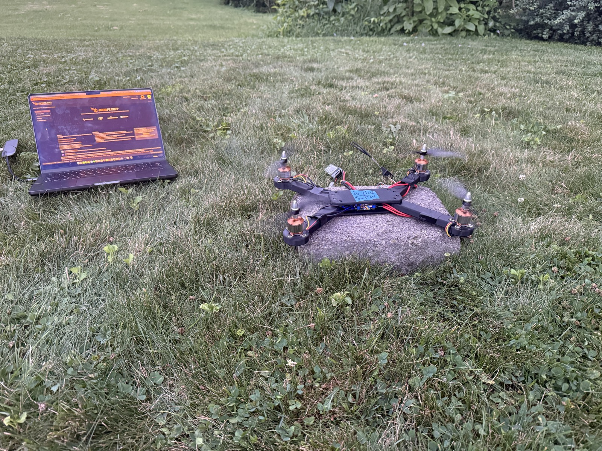

# Testing and Validation

## Test Philosophy

Testing progressed from low-risk subsystem checks to integrated flight tests. Propellers were not installed until receiver input, flight-controller orientation, motor order, and motor direction had been verified.

## Test Matrix

| Test | Configuration | Pass Criteria | Result |
|---|---|---|---|
| Visual inspection | Unpowered | No exposed conductors or loose hardware | PASS |
| Continuity / polarity | Unpowered | No short across battery input | ADD |
| Smoke-stopper power-up | Props removed | Normal startup, no overheating | PASS |
| Receiver test | Props removed | Correct channel response and endpoints | PASS |
| Accelerometer test | Props removed | Betaflight model matches physical motion | PASS |
| Individual motor test | Props removed | Correct motor responds | PASS |
| Direction test | Props removed | Each motor matches diagram | PASS |
| One-minute motor run | Props removed | No abnormal heating or vibration | PASS |
| Low-throttle test | Props installed | Symmetric spool-up | PASS |
| Takeoff test | Open area | Clean liftoff without tip-over | PASS AFTER ITERATION |
| Hover test | Low altitude | Sustained controlled hover | PASS WITH DRIFT — hover achieved, drift not yet tuned out |
| Controlled flight | Open area | Pilot can translate and land safely | IN PROGRESS — limited so far by available open space and pilot experience; further open-field testing planned |

## Failure Analysis

### Takeoff Flip

**Observed behavior:** The aircraft became light on its landing surface and flipped.

**Possible causes evaluated:**

- Incorrect motor order
- Incorrect motor rotation
- Incorrect propeller placement
- Incorrect flight-controller orientation
- Incorrect accelerometer calibration
- Uneven or unstable launch surface
- Wiring or ESC output problem

**Corrective process:**

1. Removed propellers.
2. Verified each motor number in Betaflight.
3. Verified each motor's physical rotation.
4. Matched propellers to the required rotation.
5. Checked the setup model against physical roll, pitch, and yaw movement.
6. Recalibrated the accelerometer on a level surface.
7. Retested on a flat, rigid surface.

**Outcome:** Successful takeoff and hover were achieved after configuration and assembly checks.

  

  

### Ongoing: Hover Drift

The vehicle hovers but drifts noticeably rather than holding a fixed position. This hasn't been resolved yet — the current plan is more PID/rate tuning combined with additional stick time in a properly open field (the available test space so far has been tight, which limits how aggressively drift can be safely corrected mid-flight).

  

## Flight Evidence Captured So Far

- Outdoor low-altitude hover test (above).
- Motor CW/CCW direction reference used during setup.
- Betaflight accelerometer calibration and orientation-model verification.

**Still to capture:**

- 10–20 second stationary hover from the side, once drift is tuned out.
- Takeoff, short translation, and landing, in a larger open field.
- Top, bottom, and side views of the finished vehicle.

## Quantitative Data to Add

- Takeoff mass
- Hover throttle
- Hover time
- Battery voltage before and after flight
- Motor temperature after flight
- Maximum stable altitude tested
- Propeller size
- Ambient wind conditions

Store raw measurements in `test-data/`.
